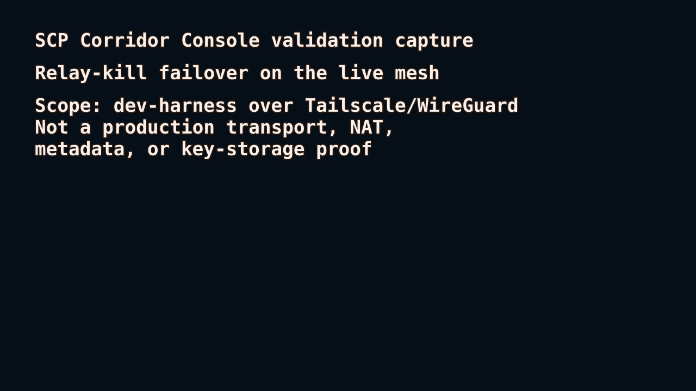

# SCP — Sovereign Communication Protocol

A consent-based cryptographic relationship protocol. Identity is sovereign. Transport forgets. The user owns the relationship, not the infrastructure.



**SCP is building a speedometer for metadata exposure.** This recorded dev-harness
run keeps two blind relays configured, kills one relay for real, and still
delivers the message through the survivor.

Live demo: <https://rbardyla-boop.github.io/scp/>

Evidence log:
[`relay-kill-failover-live-2026-07-05.log`](docs/design/corridor-console-validation/relay-kill-failover-live-2026-07-05.log)

Demo scope: dev-harness replay over Tailscale/WireGuard. This is not production
transport security, NAT traversal, production metadata resistance, or a
real-world anonymity guarantee.

## Architecture

| Layer | Role |
|-------|------|
| State | Trust continuity + consent memory (Substrate / Cosmos) |
| Transport | Ephemeral encrypted burst transmission (dev-harness relay path today; production transport hardening planned) |
| Edge | Local sovereign UX (Rust core + Kotlin / Swift / Tauri shells) |

## Build Roadmap

| Phase | Focus |
|-------|-------|
| 0 | Cryptographic Core |
| 1 | State Machine Layer |
| 2 | Relay Mesh Alpha |
| 3 | Reference Client |
| 4 | Recovery Layer |
| 5 | Metadata Resistance Hardening |
| 6 | Multi-Client Federation |
| 7 | Formal Verification + Audit |
| 8 | Sovereign Infrastructure Decision |

## Workspace

```
core/        — identity · vitality · transport · recovery · cryptography
relay/       — mesh · cache · perturbation
ledger/      — substrate · cosmos
client/      — mobile (Android/iOS) · desktop (Tauri)
test/        — adversarial · recovery · metadata · transport
docs/        — philosophy · sts · threat-model · cryptography · transport
```

## Dev Harness Status

| Milestone | Verdict |
|-----------|---------|
| Trial 0 — in-process encrypted exchange | `TRIAL_0_IN_PROCESS_CRYPTOGRAPHIC_EXCHANGE_PROVEN` |
| Level 1 — multi-process localhost exchange | `MULTIPROCESS_LOCALHOST_DEV_HARNESS_PROVEN` |
| Level 2 — three-machine LAN/mesh exchange | `LEVEL_2_LAN_DEV_HARNESS_PROVEN` |
| Option 1 — ProviderPool real-network liveness observation | `PROVIDERPOOL_REAL_NETWORK_LIVENESS_OBSERVATION_PROVEN` |
| Option 2 — pool-liveness-gated multi-relay routing | `PROVIDERPOOL_MULTIRELAY_ROUTING_SEAM_PROVEN` |

Workspace serial baseline at authorized commit `b2ac7f499cb4564cf746657f3b14d0252b12badf`: **429 passing, 0 failed**.
Current HEAD serial baseline: **546 passing, 0 failed, 2 ignored** (live-mesh tests, run manually per `docs/architecture/LAN_DEV_HARNESS_RUNBOOK.md`).

Binaries: `scp-cli` (Endpoint A/B) and `scp-relay` (relay node). See `docs/architecture/LAN_DEV_HARNESS_RUNBOOK.md` for deployment procedure.

Note: `sim_s34` and `sim_s41` exhibit RNG-based flakiness under parallel execution. Use `--test-threads=1` for deterministic results.

## Quick Start

```bash
cargo check --workspace
cargo build --release
cargo test --workspace -- --test-threads=1
```

## Planning Gates

- `docs/architecture/PRODUCTION_READINESS_BUILD_PLAN.md` defines the review, self-correction, test, lint, and release-build gate for production-readiness work without authorizing production deployment.
- `docs/PRODUCT_VECTOR_SCALE_POSTMORTEM.md` defines the initial product vector, scalability plan, and one-year failure post-mortem criteria.
